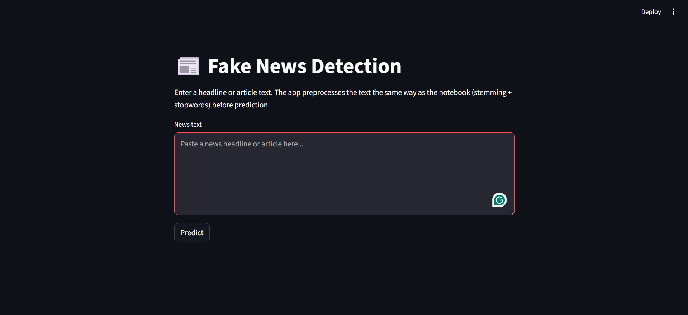

# Fake News Detection

  
*Screenshot of the Streamlit app detecting fake news*

---

## Project Overview

This project detects whether a news article or headline is **Real** or **Fake** using **Machine Learning**.  
The model is trained on a dataset of news articles and uses **Logistic Regression** with **TF-IDF vectorization**.  

**Features:**
- Text preprocessing: stopwords removal, stemming.
- Machine learning model with high accuracy.
- Web interface built with **Streamlit** for easy usage.
- Predicts in real-time if the news is fake or real.

---

## Demo Screenshots

**Fake News Example:**

  

**Real News Example:**

  

---

## Project Structure

Fake-News-Detection/
├─ app.py
├─ model.pkl
├─ vectorizer.pkl
├─ requirements.txt
├─ README.md
├─ screenshots/
│   ├─ fake_news_app.png
│   ├─ fake_news_example.png
│   └─ real_news_example.png
└─ .gitignore

